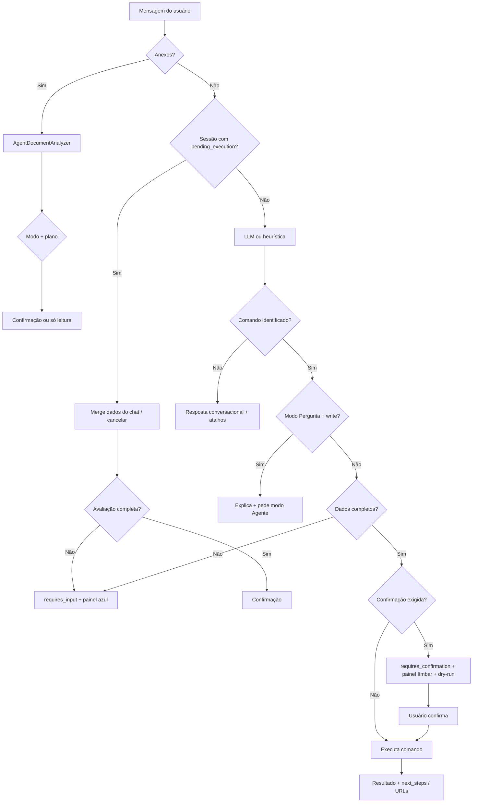

# IA operacional — Copiloto Acesso Equipamentos

Panorama de **como a inteligência artificial opera** no ERP Gestão Acesso: personalidade, fluxos, modos, API, guardrails e extensão.

Documentação técnica complementar (camadas de código): [`AGENT_ARCHITECTURE.md`](AGENT_ARCHITECTURE.md).

---

## O que é (e o que não é)

A IA é o **copiloto operacional** da **Acesso Equipamentos**, integrada ao ERP. Foi desenvolvida por **José**.

| É | Não é |
|---|--------|
| Operador via **API estruturada** (comandos atômicos) | Automação de tela / cliques simulados |
| Interpretação de linguagem natural (PT-BR) | Substituto do Sisloc/Protheus fiscal |
| Consulta e execução **com permissões Spatie** | Acesso irrestrito ao banco |
| Auditável (sessões, mensagens, comandos) | Caixa-preta sem rastro |

**Posicionamento:** mesma liberdade conceitual de um agente de IDE sobre código — aplicada ao domínio locação, frota, financeiro, OS e CRM.

---

## Personalidade

Estilo **Jarvis** (competente, levemente espirituoso) com ~**30% Rocket** (ironía suave, confiança) e **70% foco em resolver**.

- Informal e direta, **sempre respeitosa**
- Piada **curta** quando couber; em seguida volta ao problema
- **Sem** deboche ao usuário, JSON cru ou erro técnico na UI
- Em falha de IA, permissão negada ou modo degradado: **menos humor, mais clareza**

Mensagens fixas da interface passam por `CopilotUserMessenger` (tom amigável). Respostas dinâmicas vêm do LLM guiado por `AgentModeContext`.

---

## Dois modos do copiloto

| Modo | Label UI | Superfície | Efeito |
|------|----------|------------|--------|
| **Pergunta** | `ask` | `visualization` / `read` | Consulta, filtra, abre fichas, exporta. **Nada grava.** |
| **Agente** | `agent` | `visualization` + `execution` / `write` | Pode cadastrar, avançar fluxos, faturar — **com confirmação** ou fila em background. |

No modo **Pergunta**, o LLM só recebe ferramentas de visualização no manifest. Pedidos de escrita são explicados e o usuário é orientado a mudar para **Agente**.

---

## Arquitetura em camadas

```
Usuário (painel flutuante / API)
        │
        ▼
AgentChatOrchestrator ──► AgentLlmDriver (LLM-first, se AGENT_LLM_ENABLED)
        │                        │
        │                        ▼ falha (quota, timeout, auth…)
        │                  Heurística PT (AgentHeuristicParser) + aviso degradado
        │
        ├──► Avaliação de dados (AgentInputCompletionService)
        │         └── pausa com pending_execution na sessão
        ├──► Confirmação + dry-run (SupportsDryRun)
        ├──► AgentCommandExecutor (permissão, validação, auditoria, concorrência)
        └──► Resposta amigável (CopilotUserMessenger)
```

### LLM-first e fallback

1. Com `AGENT_LLM_ENABLED=true` e chave válida, o modelo interpreta o pedido e escolhe ferramentas do **manifest** (`GET /api/agent/manifest`).
2. Se a IA falhar (tokens/créditos, rate limit, timeout, contexto longo, serviço indisponível), o sistema:
   - cai para **regras heurísticas** (palavras-chave, códigos LOC-/PAT-/ORC-…);
   - informa o usuário com banner **“Inteligência operacional indisponível”** (`llm_degraded`);
   - recomenda verificar plano/créditos ou usar telas do ERP.
3. Sem LLM configurado, opera só com heurísticas (aviso discreto no painel).

Classificação de falhas: `AgentLlmFailureClassifier`.

### Comandos atômicos

Cada capacidade de negócio é um **comando** em `app/Agent/Commands/*`, registrado em `config/agent.php` (~**56 comandos**).

Cada comando expõe:

- `name`, `description`, `permission` (Spatie)
- `surface`: `visualization` | `execution`
- `kind`: `read` | `write`
- `input_schema` (validação)
- opcional: `dryRun()`, `affectedResources()` (concorrência)

Execução centralizada em `AgentCommandExecutor` → serviços de domínio existentes (mesmas regras da UI).

---

## Fluxo principal do chat



### Pausa por dados incompletos

Comandos de escrita sensíveis declaram requisitos em `AgentCommandRequirementsRegistry` (ex.: `quote.create` exige patrimônio + cliente).

1. Orquestrador detecta campos faltantes → `requires_input: true`
2. Sessão grava `pending_execution` (comando + input parcial)
3. UI mostra painel **“Informações pendentes”** (rótulo humano, não código interno)
4. Usuário completa no chat → merge heurístico (`AgentInputCompletionService::mergeFromMessage`)
5. Quando completo → fluxo de **confirmação** → execução

Intents como **“abrir contrato”** mapeiam para `quote.create` (LLM ou heurística).

### Confirmação e dry-run

No modo **Agente**, writes pedem confirmação (`AGENT_CHAT_REQUIRE_CONFIRMATION`, padrão `true`).

- Painel **“Deseja que eu faça?”** com rótulo da ação
- Opcional: **prévia dry-run** (simulação sem gravar) em faturamento, cadastros, locação, etc.
- Botões: executar agora, **executar em background**, cancelar

### Execução em background

`POST /api/agent/tasks` enfileira planos multi-passo (`AgentTaskService`).

- Antes de cada write: `AgentConcurrencyGuard` compara `updated_at` dos recursos
- Se o usuário editou a ficha na UI → tarefa em **conflito** (`resource_conflict`)
- Sync também verifica snapshot quando aplicável

### Análise de documentos

Anexos (PDF, imagem, TXT, etc.) no painel flutuante:

1. Extração de texto ou visão (`DocumentTextExtractor`)
2. LLM retorna JSON: `reply`, `extracted`, `proposed_actions`
3. Modo **Pergunta**: só explica — `proposed_actions` vazio
4. Modo **Agente**: pode propor `customer.create`, `rental.reserve`, `document.apply_plan`, etc., seguido de confirmação

---

## Contexto para a IA

### Context API (HTTP)

| Endpoint | Conteúdo |
|----------|----------|
| `GET /api/agent/context/rental/{id\|codigo}` | Ficha locação, workflow, URLs |
| `GET /api/agent/context/customer/{id}` | Cliente, bloqueios, títulos |
| `GET /api/agent/context/asset/{id\|codigo}` | Patrimônio, status, locação ativa |
| `GET /api/agent/context/quote/{id\|codigo}` | Orçamento, validade, itens |
| `GET /api/agent/context/receivable/{id\|codigo}` | Título, aging |
| `GET /api/agent/context/maintenance/{id\|codigo}` | OS, peças, horas |
| `GET /api/agent/context/system` | Resumo operacional da empresa ativa |

### Contexto de tela (UI)

Com o painel aberto em uma ficha (locação, patrimônio, cliente, OS), `CopilotScreenContextResolver` injeta JSON estruturado na mensagem enviada ao orquestrador — a IA “vê” a ficha aberta sem automação de tela.

---

## Comandos por domínio (resumo)

| Domínio | Leitura (exemplos) | Escrita (exemplos) |
|---------|-------------------|-------------------|
| **Locação** | `rental.get`, `rental.list`, `rental.stats` | `rental.reserve`, `checkout`, `return`, `cancel`, `extend`, `substitute`, `update`, `transfer_commercial` |
| **Orçamento** | `quote.list`, `quote.get` | `quote.create`, `send`, `cancel`, `convert` |
| **Frota** | `asset.get`, `asset.list`, `yard.list` | `asset.move_location`, `asset.transition_status` |
| **Cliente** | `customer.search`, `customer.get` | `customer.create`, `customer.update` |
| **CRM** | `person.search`, `company.search`, … | `person.create/update`, `company.create/update` |
| **Faturamento** | `billing.list_pending`, `billing.get` | `billing.authorize_entry`, `invoice_entry`, `process_customer_pending`, `create_renewal` |
| **Financeiro** | `finance.summary`, `finance.delinquency`, `receivable.list/get` | `receivable.mark_paid`, `finance.accounting_export` |
| **Manutenção** | `maintenance.list`, `maintenance.get` | `maintenance.open`, `start`, `wait_part`, `resume`, `complete` |
| **Logística** | `logistics.daily` | — |
| **Transversal** | `search.global` | `document.apply_plan` (plano multi-ação pós-documento) |

Lista completa e schemas: `php artisan agent:manifest` ou `GET /api/agent/manifest`.

---

## API HTTP (Sanctum)

Autenticação: token Sanctum + permissão `agent.api`. Header opcional: `X-Operating-Company-Id`.

| Método | Rota | Uso |
|--------|------|-----|
| GET | `/api/agent/manifest` | Descoberta (modos, identidade, comandos) |
| POST | `/api/agent/commands/{name}` | Executar comando (`dry_run`, `session_id`) |
| POST | `/api/agent/chat` | Chat (`mode`: `ask` \| `agent`, anexos, confirmação) |
| GET | `/api/agent/context/*` | Contexto estruturado |
| POST | `/api/agent/tasks` | Enfileirar plano background |
| GET | `/api/agent/tasks/{id}` | Status / conflito |

Resposta de chat inclui, quando aplicável: `reply`, `command`, `requires_confirmation`, `requires_input`, `input_request`, `dry_run_preview`, `llm_degraded`, `llm_notice`, `actions` (atalhos com `url` ou `command`).

---

## Interface web

| Recurso | Onde |
|---------|------|
| Painel flutuante | Todas as telas (Livewire `CopilotPanel`) — permissão `agent.api` |
| Página dedicada | `/copiloto` |
| Logs admin | `/admin/copiloto-logs` |

Elementos do painel:

- Toggle **Pergunta / Agente**
- Banner degradado (IA indisponível)
- Painel azul: dados pendentes
- Painel âmbar: confirmação de execução
- Atalhos e links para fichas/exportações

---

## Auditoria

Tabelas: `agent_sessions`, `agent_session_messages`, `agent_command_logs`, `agent_tasks`.

Registra: usuário, modo, mensagens, comando, input (chaves), ok/erro, dry-run, tarefas background.

---

## Configuração (`.env`)

| Variável | Descrição |
|----------|-----------|
| `AGENT_LLM_ENABLED` | Habilita interpretação por modelo |
| `AGENT_LLM_API_KEY` | Chave API (OpenAI-compatible) |
| `AGENT_LLM_BASE_URL` | Padrão `https://api.openai.com/v1` |
| `AGENT_LLM_MODEL` | Ex.: `gpt-4o-mini` (visão para PDF/imagem escaneado) |
| `AGENT_LLM_TIMEOUT` | Timeout HTTP (s) |
| `AGENT_CHAT_REQUIRE_CONFIRMATION` | Confirmação antes de writes (padrão `true`) |
| `AGENT_MAX_ATTACHMENTS` | Anexos por mensagem |
| `AGENT_MAX_ATTACHMENT_KB` | Tamanho máximo por anexo |

Token API: `php artisan tinker` → `$user->createToken('agent')`.

---

## Mapa de arquivos principais

| Caminho | Responsabilidade |
|---------|------------------|
| `app/Agent/Chat/AgentChatOrchestrator.php` | Orquestração do chat |
| `app/Agent/Chat/AgentLlmDriver.php` | Chamada LLM + tool calling |
| `app/Agent/Chat/AgentHeuristicParser.php` | Fallback heurístico PT |
| `app/Support/Agent/AgentModeContext.php` | Persona e regras no prompt |
| `app/Support/Agent/CopilotUserMessenger.php` | Mensagens amigáveis ao usuário |
| `app/Support/Agent/AgentInputCompletionService.php` | Pausa / merge de dados |
| `app/Support/Agent/AgentCommandRequirementsRegistry.php` | Campos obrigatórios por comando |
| `app/Agent/AgentCommandExecutor.php` | Execução, permissão, auditoria |
| `app/Agent/Document/AgentDocumentAnalyzer.php` | Documentos anexos |
| `app/Livewire/Copilot/CopilotPanel.php` | UI do painel |
| `config/agent.php` | Registro de comandos |

---

## Testes automatizados

| Arquivo | Foco |
|---------|------|
| `tests/Feature/AgentApiTest.php` | API manifest, comandos, contexto |
| `tests/Feature/AgentCopilotTest.php` | UI Livewire, documentos, modos |
| `tests/Feature/AgentInputPauseTest.php` | Pausa, retomada, cancelamento |
| `tests/Feature/AgentLlmFallbackTest.php` | Degradação LLM + fallback |
| `tests/Feature/CopilotUserMessengerTest.php` | Mensagens amigáveis |

```bash
php artisan test --filter=Agent
```

---

## Como estender

1. Criar comando em `app/Agent/Commands/*` (`AbstractAgentCommand` ou `AbstractReadAgentCommand`).
2. Registrar em `config/agent.php`.
3. Opcional: requisitos de input em `AgentCommandRequirementsRegistry`.
4. Opcional: `affectedResources()` para concorrência em background.
5. Opcional: contexto em `AgentContextBuilder` + rota em `ContextController`.
6. Rodar testes e `php artisan agent:manifest` para validar.

Com LLM habilitado, **não é necessário** adicionar heurística — o modelo descobre o comando pelo manifest. Heurísticas são rede de segurança quando a IA está off ou degradada.

---

## Roadmap natural

- Webhook / SSE para progresso de tarefas no painel
- Histórico multi-turn mais rico na sessão LLM
- Mais entidades no context API
- Idempotency keys em integrações externas via agente
